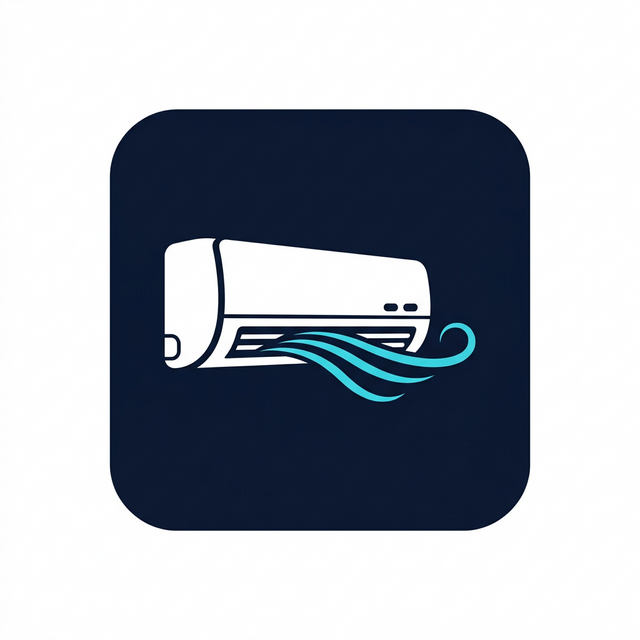

<div align="center">



# Aqsa Aulia AC

**A modern landing page for an Air Conditioner (AC) service business - servicing, installation, relocation, and sales.**


[Features](#features) - [Tech Stack](#tech-stack) - [Installation](#installation) - [Running Locally](#running-locally) - [Project Structure](#project-structure) - [License](#license)

[Bahasa Indonesia](README.md) | **English**

</div>

---

## About

Aqsa Aulia AC is a professional landing page built for an AC service business. It showcases all available services, business highlights, a portfolio gallery, customer testimonials, and complete contact information - all in one elegant, responsive page.

Built with a premium dark-blue theme, smooth animations, and a conversion-focused design that encourages visitors to reach out via WhatsApp.

## Features

- **Hero Section** - Full-screen gradient with business stats and a WhatsApp CTA button
- **Services** - 6 service cards: AC Servicing, New Installation, Relocation, Buy & Sell, Emergency AC, Routine Maintenance
- **Why Us** - Business value points with a CTA banner
- **Gallery** - Portfolio grid ready to be filled with real photos
- **Testimonials** - Customer reviews with star ratings and satisfaction summary
- **Contact** - Complete contact info with a direct WhatsApp button
- **Responsive Navbar** - Sticky navbar with active section tracking and mobile menu
- **Full Footer** - Navigation links, services list, and contact info
- **SEO-Ready** - Full metadata in Indonesian
- **Dark Mode** - Built-in dark mode support
- **Fully Responsive** - Looks great on all screen sizes

## Tech Stack

| Technology                                                | Version | Description                     |
| --------------------------------------------------------- | ------- | ------------------------------- |
| [Next.js](https://nextjs.org)                             | 16      | React framework with App Router |
| [React](https://react.dev)                                | 19      | UI library                      |
| [TypeScript](https://typescriptlang.org)                  | 5       | Type safety                     |
| [Tailwind CSS](https://tailwindcss.com)                   | 4       | Utility-first styling           |
| [shadcn/ui](https://ui.shadcn.com)                        | 4       | UI component library            |
| [Lucide React](https://lucide.dev)                        | -       | Icon library                    |
| [next-themes](https://github.com/pacocoursey/next-themes) | -       | Dark mode                       |

## Requirements

- Node.js `>= 18.x`
- npm `>= 9.x`

## Installation

```bash
# Clone the repository
git clone https://github.com/username/aqsa-aulia-ac.git
cd aqsa-aulia-ac

# Install dependencies
npm install
```

## Running Locally

```bash
# Development mode (with Turbopack)
npm run dev
```

Open [http://localhost:3000](http://localhost:3000) in your browser.

Other commands:

```bash
npm run build      # Build for production
npm run start      # Run production build
npm run lint       # Run ESLint
npm run format     # Format code with Prettier
npm run typecheck  # TypeScript type check
```

## Configuration

All website content (WhatsApp number, address, services, pricing, testimonials, etc.) is centralized in one file:

```
lib/constants.ts
```

No `.env` file needed. Simply edit `lib/constants.ts` to customize the content:

```ts
export const siteConfig = {
  name: "Aqsa Aulia AC",
  whatsapp: "6281234567890",   // Replace with active WhatsApp number
  email: "aqsaauliaac@gmail.com",
  address: "Jl. Raya No. 123, Your City",
  // ...
}
```

## Project Structure

```
aqsa-aulia-ac/
├── app/
│   ├── globals.css           # Blue brand theme + custom utilities
│   ├── layout.tsx            # Root layout & SEO metadata
│   └── page.tsx              # Main page (assembles all sections)
├── components/
│   ├── layout/
│   │   ├── navbar.tsx        # Sticky navbar + mobile menu
│   │   └── footer.tsx        # Footer
│   ├── sections/
│   │   ├── hero.tsx          # Hero section
│   │   ├── services.tsx      # Services section
│   │   ├── why-us.tsx        # Why us section
│   │   ├── pricing.tsx       # Pricing section (currently disabled)
│   │   ├── gallery.tsx       # Portfolio gallery
│   │   ├── testimonials.tsx  # Customer testimonials
│   │   └── contact.tsx       # Contact & WhatsApp CTA
│   └── ui/
│       └── button.tsx        # Button component (shadcn)
├── lib/
│   ├── constants.ts          # All content data & config
│   └── utils.ts              # Utilities (cn)
├── public/                   # Static assets (photos, favicon)
├── logo.png                  # Project logo
└── LICENSE
```

## Notes

- The **Pricing** section (`pricing.tsx`) is currently disabled. Re-enable it by uncommenting the relevant lines in `app/page.tsx`.
- **Gallery** photos are placeholders. Replace them with real photos in `components/sections/gallery.tsx` using Next.js `<Image>` component.
- The WhatsApp number, address, and other details are sample data. Update `lib/constants.ts` before deploying.

---

## Support

If this project is helpful, you can support further development:

<a href="https://trakteer.id/alhifnywahid" target="_blank"></a>&nbsp;<a href="https://saweria.co/alhifnywahid" target="_blank"></a>

## Community

Join and discuss with other users:

<a href="https://t.me/gopretstudio" target="_blank"></a>

## License

[MIT](LICENSE) - free to use and modify with attribution.
